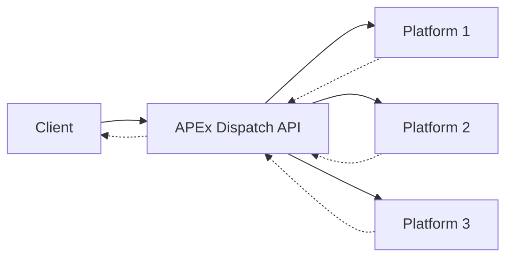
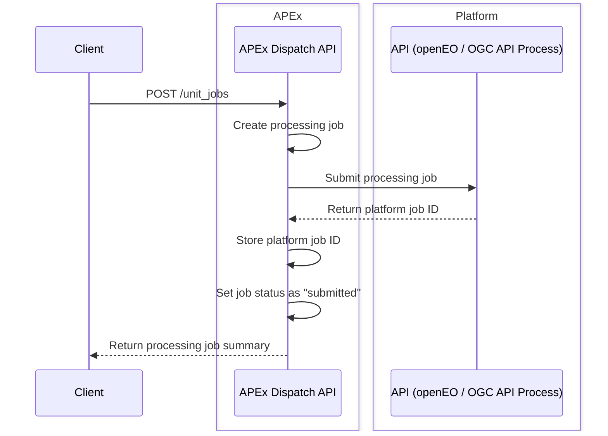
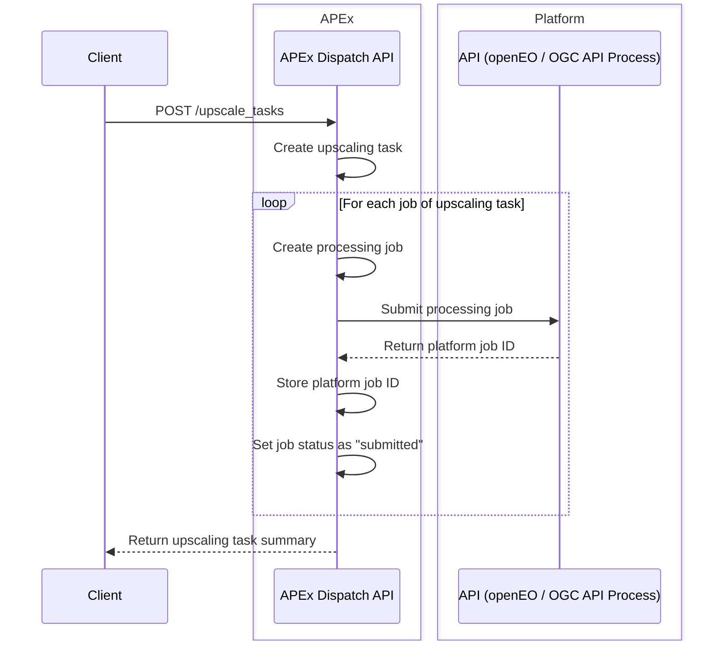
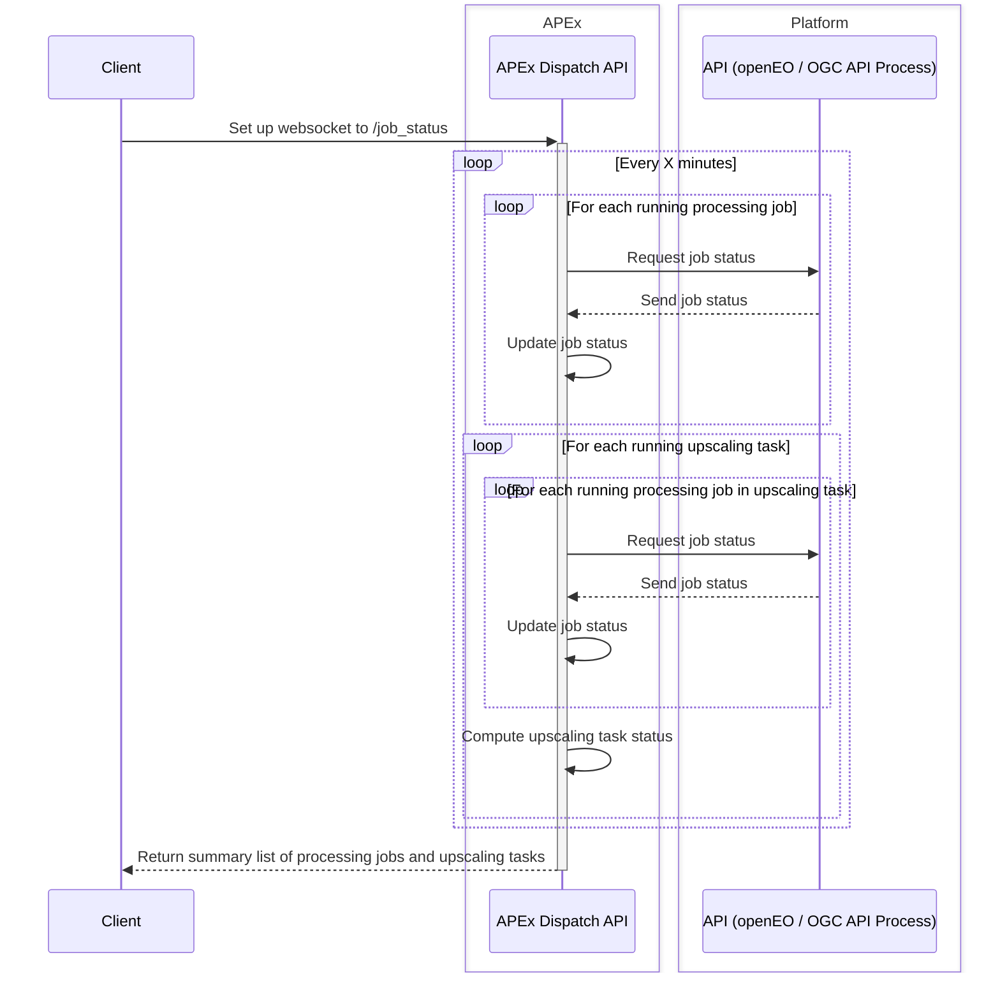

# Architecture Overview

The **APEx Dispatch API** acts as a **broker service** that allows clients to trigger job executions on external Earth Observation platforms.  
Instead of interacting directly with platform-specific APIs, clients can use the **uniform Dispatch API interface**, while the dispatcher handles the translation and job management.

##  Key Concepts

### Dispatch API

The **Dispatch API** is the core component of the system. It acts as the entry point for clients who want to execute jobs or perform upscaling tasks. When a job request is submitted, the dispatcher takes care of translating it into a **platform-specific request** using standards such as [openEO](https://openeo.org/) or [OGC API – Processes](https://ogcapi.ogc.org/processes/) that is sent to an existing EO platform, such as CDSE or the Geohazard Exploitation Platform. Beyond handling the translation, the dispatcher is also responsible for storing all relevant job information, including metadata and references to the external platform where the job is ultimately executed.

### Processing Job Execution

When a client wants to perform a task, it submits a job to the Dispatch API. A job request typically contains two main pieces of information: the service that needs to be executed and the parameters required for that service. Once received, the dispatcher forwards this request to the chosen external platform, which carries out the execution. In response, the platform provides a job identifier, which the dispatcher records internally to keep track of the execution.

After a job has been submitted and forwarded to an external platform, the dispatcher maintains an internal record of it. This record includes a unique internal job identifier, which the client can use for reference, as well as the mapping to the external platform’s job ID. Additional metadata, such as the job status, the creation timestamp, and the parameters used during submission, are also stored. This internal tracking mechanism ensures that the client has a single point of reference for all jobs, regardless of where they are executed.

### Upscaling Task Execution

In addition to individual job submissions, the dispatcher also supports **upscaling** activities. In this case, a client submits a request that includes not just the target service and execution parameters, but also a **parameter dimension with multiple values**. The dispatcher uses this information to generate multiple job requests, each corresponding to one value in the parameter dimension, and forwards them to the external platform. From the client’s perspective, however, this entire batch of jobs is managed as a single **upscaling task**. The dispatcher keeps track of the execution of all related jobs and exposes them as part of one unified task, simplifying monitoring and retrieval for the user.

### Status Retrieval

To check the progress of their jobs and upscale tasks, clients use a single status endpoint exposed by the Dispatch API. When such a request arrives, the dispatcher looks up the corresponding external job reference stored in its internal records. It then queries the external platform to obtain the most up-to-date status. This status information is returned to the client, allowing them to monitor their job execution transparently through the dispatcher without needing to interact with the external platform directly.

## Authentication and Authorization

Authentication and authorization are critical components of the APEx Dispatch API, as jobs launched through the API result in resource consumption on external platforms. To support remote job execution and manage this resource usage effectively, the project has identified two distinct scenarios:

### APEx Service Account (Current Implementation)

In this scenario, all jobs are executed on the external platforms using a generic APEx service account that has access to them. This means that each job or upscaling task triggered through the API is executed on the platform under the APEx account, rather than the actual user’s identity. However, the Dispatch API maintains the link between the platform job ID and the user who initiated the request in its database.

**Pros:**

* Provides a seamless user experience: users do not need to create or manage platform-specific accounts.
* Simplifies integration for clients using the Dispatch API.
  
**Cons:**

* For each new platform, a dedicated APEx account must be created and funded appropriately. Estimating the required funding in advance is challenging, especially since the account is shared across all users.
* No user-level auditing or accounting is available. Users can continue triggering jobs as long as the APEx account has sufficient funds. This poses a risk of misuse, potentially leading to service disruption for all users if the APEx account is depleted.
* Implementing safeguards would require advanced accounting features within the Dispatch API, requiring the translation of existing business models into a uniform business logic. This adds complexity and may introduce additional costs by layering over existing platform models.

### User Impersonation (Preferred Approach)

The preferred solution is to execute jobs on behalf of the user who initiates the request via the APEx Dispatch API. In this model, all accounting and access control are handled directly by the platform, and users are responsible for maintaining sufficient access and funding—potentially supported through the ESA Network of Resources (NoR).

**Pros:**

* No need for custom accounting logic in the APEx Dispatch API, as platforms handle this natively.
* APEx avoids introducing a layer over the platform’s existing business model, preserving operational simplicity.

**Cons:**

* Propagating user identity across platforms is a technical challenge and currently lacks a proven, ready-to-use solution.
* May require modifications on the target platform to support user impersonation, depending on the chosen implementation strategy.